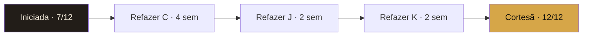

# Visão Mentorada — Layout do Dashboard Individual

Dashboard que cada mentorada da Corte abre pra ver onde está, o que falta e qual o próximo passo. Layout pensado pra clareza emocional: ela vê progresso, não só falha. Output HTML standalone (template em `TEMPLATE-HTML.md`).

---

## Princípios de design

1. **Você vê só você.** Nunca aparece nome ou número de outra mentorada. Privacidade total.
2. **Foco no agora, contexto no histórico.** Topo é "porta atual + próximo passo". Histórico fica abaixo.
3. **Próximo passo é uma ação, não uma palestra.** A skill devolve o comando pronto pra rodar (`/skill-x ...`).
4. **Distância pra próximo nível é numérica.** "Faltam 3 portas verdes pra Cortesã" — sem subjetivismo.
5. **Cor é honesta.** Vermelho aparece como vermelho. Não suaviza. Sem isso, mentorada confunde gentileza com gate fechado.

---

## Estrutura do dashboard (do topo pra baixo)

### 1. HEADER

Mostra:

- Eyebrow: "MÉTODO IMPERATRIZ · DASHBOARD INDIVIDUAL · {{MES_ANO}}"
- H1: "Sua *Travessia*" (Instrument Serif, dourado #D6A648 no itálico)
- Subtitle personalizada: "[Nome], você está na porta {{LETRA}} ({{NOME_PORTA}}). {{N_VERDES}} de 26 KPIs verdes."
- Meta-row com 4 cards:
  - **Nível atual** ({{Iniciada/Cortesã/Dama/Imperatriz}})
  - **Porta atual** ({{LETRA}} — {{NOME}})
  - **Score** ({{PCT}}% verde)
  - **Próxima Investidura** ({{NIVEL_ALVO}} em {{N_PORTAS}} portas)

---

### 2. NAV TABS (sticky)

5 tabs:
1. **Sua porta atual** (default) — KPI + número + benchmark + ação
2. **Próximo passo** — o que `/tatou-2.0` recomenda agora
3. **Suas 26 portas** — visão completa por porta com cor
4. **Histórico** — últimos 6 meses
5. **Próximo nível** — distância pra Investidura

---

### 3. PANEL: SUA PORTA ATUAL

Peça central. Mostra a foto do KPI hoje.

#### 3.1 Card grande: KPI primário

```
┌─────────────────────────────────────────────────┐
│ PORTA K — TRÁFEGO PAGO                          │
│                                                  │
│ KPI: ROAS                                        │
│                                                  │
│         1,8x                                     │
│   ─────────                                      │
│         3,0x                                     │
│                                                  │
│ Você está em 60% do benchmark.                   │
│ Precisa subir 67% pra fechar o gate.             │
│                                                  │
│ STATUS: 🔴 VERMELHO                              │
└─────────────────────────────────────────────────┘
```

#### 3.2 Por que está vermelho (diagnóstico técnico)

```
DIAGNÓSTICO

Sua porta K (ROAS) está vermelha porque o ROAS de 1,8x está abaixo
do mínimo (2,1x amarelo / 3,0x verde) pra mentora high-ticket BR.

PORTA-FONTE PROVÁVEL: C (Causa / Mecanismo único)
  ↳ Seu mecanismo único nomeado mas sem proof stack consolidada
  ↳ Criativos sem pattern interrupt do mecanismo

ROLLBACK SUGERIDO: refazer C antes de continuar K
```

#### 3.3 Ação imediata (com comando pronto pra copiar)

```
PRÓXIMA AÇÃO

Refazer mecanismo único com proof stack:

  /mecanismo-unico --auditar
  
Depois:
  /headline-imperatriz --temperatura frio
  /skill-copy-ads-ptbr --pattern-interrupt

Estimativa: 2 semanas pra rollback completo.
```

---

### 4. PANEL: PRÓXIMO PASSO (output do tatou-2.0)

```
┌─ TATOU-2.0 RECOMENDA ─────────────────────────┐
│                                                │
│ Esta semana:                                   │
│ 1. Audit do mecanismo único                    │
│    → /mecanismo-unico --auditar                │
│ 2. Reescrever proof stack                      │
│    → /briefing-copy-360                        │
│                                                │
│ Próxima semana:                                │
│ 3. Rodar 3 criativos novos com pattern         │
│    → /skill-copy-ads-ptbr                      │
│ 4. Lançar com R$ 500 teste                     │
│    → /maestro-trafego                          │
│                                                │
│ Em 2 semanas:                                  │
│ 5. Re-medir ROAS e retornar pro dashboard      │
│                                                │
│ [Copiar plano completo]                        │
└────────────────────────────────────────────────┘
```

---

### 5. PANEL: SUAS 26 PORTAS

Grid 6×5 (ou 13×2 mobile) com 26 quadrados — uma por porta. Cada quadrado:

- Letra grande
- Nome da porta abaixo
- Cor de fundo (verde/amarelo/vermelho/cinza-fora-do-escopo)
- Hover ou click → expande mostrando:
  - KPI primário
  - Valor atual
  - Benchmark
  - Última medição
  - Botão "Ver detalhe"

Pseudo-visual:

```
┌────┐ ┌────┐ ┌────┐ ┌────┐ ┌────┐
│ A  │ │ B  │ │ C  │ │ D  │ │ E  │
│ 🟢 │ │ 🟢 │ │ 🔴 │ │ 🟢 │ │ 🟢 │
└────┘ └────┘ └────┘ └────┘ └────┘
Aterr. Búss.  Causa  Difer. Estét.

┌────┐ ┌────┐ ┌────┐ ┌────┐ ┌────┐
│ F  │ │ G  │ │ H  │ │ I  │ │ J  │
│ 🟡 │ │ 🟢 │ │ 🟢 │ │ 🟡 │ │ 🔴 │
└────┘ └────┘ └────┘ └────┘ └────┘
Fluên. Garan. Hábi.  Ímã    Jorn.

[continua até Z...]
```

Filtro acima:
- "Mostrar só vermelhas"
- "Mostrar só amarelas"
- "Mostrar minhas portas (do meu nível)"

---

### 6. PANEL: HISTÓRICO

Linha do tempo com últimos 6 meses (1 linha por mês). Cada linha = mini-matriz de 26 quadrados coloridos.

```
DEZ/2025  ⬜⬜⬜⬜⬜⬜⬜⬜⬜⬜⬜⬜⬜⬜⬜⬜⬜⬜⬜⬜⬜⬜⬜⬜⬜⬜  (entrada)
JAN/2026  🟢🟡⬜⬜⬜⬜⬜⬜⬜⬜⬜⬜⬜⬜⬜⬜⬜⬜⬜⬜⬜⬜⬜⬜⬜⬜
FEV/2026  🟢🟢🟡🟡⬜⬜⬜⬜⬜⬜⬜⬜⬜⬜⬜⬜⬜⬜⬜⬜⬜⬜⬜⬜⬜⬜
MAR/2026  🟢🟢🟢🟢🟡🟡⬜⬜⬜⬜⬜⬜⬜⬜⬜⬜⬜⬜⬜⬜⬜⬜⬜⬜⬜⬜
ABR/2026  🟢🟢🟢🟢🟢🟢🟢🟡🟡🟡⬜⬜⬜⬜⬜⬜⬜⬜⬜⬜⬜⬜⬜⬜⬜⬜
MAI/2026  🟢🟢🔴🟢🟢🟡🟢🟢🟡🔴🔴⬜⬜⬜⬜⬜⬜⬜⬜⬜⬜⬜⬜⬜⬜⬜
```

Insight automatizado abaixo do histórico:

```
TENDÊNCIA

✓ Você passou de 0 portas verdes → 7 verdes em 5 meses.
⚠ Porta C virou vermelha em maio (era amarela em abril) — 
  isso contaminou K. Atenção prioritária.
↗ Próxima Investidura: Iniciada → Cortesã (faltam 5 portas verdes).
```

---

### 7. PANEL: PRÓXIMO NÍVEL

Mostra o caminho pra Investidura.

```
NÍVEL ATUAL: INICIADA
NÍVEL ALVO:  CORTESÃ

Critério: portas A-L verdes (12 portas)
Você tem: 7/12 ✓

Faltam:
  🔴 C — Causa (mecanismo único)        [prioritário]
  🟡 F — Fluência (pilotos solo)
  🟡 I — Ímã (50+ leads/mês)
  🔴 J — Jornada (conversão página)
  🔴 K — Tráfego pago (ROAS)            [bloqueado por C]

Estimativa realista: 3-4 meses
  ↳ se rodar rollback de C primeiro, J e K destravam em 6-8 sem.

Ordem sugerida pelo tatou-2.0:
  1. Refazer C (4 sem)
  2. Refazer J (2 sem após C)
  3. Refazer K (2 sem após J)
  4. F + I em paralelo (rolling)
```

Mermaid embutido com flowchart da Investidura:



---

### 8. FOOTER

- Data de geração
- Próximo update (dia 1 do próximo mês)
- Link pro JSON: `dashboard.json`
- Crédito: "Travessia Imperatriz · Tata Gonçalves"

---

## Comportamento interativo

### Cliques

- **Quadrado de porta** → modal com detalhe do KPI (definição, valor, benchmark, histórico próprio 6 meses)
- **Botão "Copiar plano completo"** → joga próximo passo formatado pra clipboard
- **Botão "Ver detalhe"** dentro de modal → link pra arquivo da porta no vault da mentorada
- **Botão "Re-medir agora"** → abre `/dossie-mentorada` profile 16-kpis-dashboard pra atualizar KPI

### Animações

- Quadrados das 26 portas entram em fade sequencial (cinemático)
- Score bate de 0 → valor real em 1s (tabular-nums)
- Tendência usa sparkline pequeno (canvas) ao lado de cada KPI

### Privacidade

- Nenhuma referência a outra mentorada
- Nenhum agregado de Corte
- Nenhum dado de receita de outras
- Lista de skills da Tata aparece, mas nunca o nome de quem as usa

---

## Schema do JSON gerado (para integrações)

```json
{
  "geracao": {
    "skill": "dashboard-imperatriz",
    "modo": "mentorada",
    "mentorada": "Larissa Lima",
    "mes_referencia": "2026-05",
    "timestamp": "2026-06-01T08:05:00-03:00"
  },
  "mentorada": {
    "nome": "Larissa Lima",
    "nivel_atual": "Iniciada",
    "porta_atual": "K",
    "score_pct": 42,
    "kpis_verdes": 7,
    "kpis_amarelos": 4,
    "kpis_vermelhos": 3
  },
  "porta_atual": {
    "letra": "K",
    "nome": "Tráfego Pago",
    "kpi_primario": "ROAS",
    "valor_atual": 1.8,
    "benchmark_verde": 3.0,
    "benchmark_amarelo_min": 2.1,
    "cor": "vermelho",
    "pct_do_benchmark": 60,
    "porta_fonte_contaminada": "C",
    "rollback_sugerido": true
  },
  "todas_portas": [
    { "letra": "A", "kpi": "dossie_completo", "valor": 100, "benchmark": 100, "cor": "verde" },
    { "letra": "B", "kpi": "icp_conv_vs_geral", "valor": 2.3, "benchmark": 2.0, "cor": "verde" },
    { "letra": "C", "kpi": "ctr_pattern_interrupt", "valor": 1.4, "benchmark": 2.4, "cor": "vermelho" },
    "..."
  ],
  "historico": {
    "2025-12": { "verdes": 0, "amarelos": 0, "vermelhos": 0 },
    "2026-01": { "verdes": 1, "amarelos": 1, "vermelhos": 0 },
    "2026-02": { "verdes": 2, "amarelos": 2, "vermelhos": 0 },
    "2026-03": { "verdes": 4, "amarelos": 2, "vermelhos": 0 },
    "2026-04": { "verdes": 7, "amarelos": 3, "vermelhos": 0 },
    "2026-05": { "verdes": 7, "amarelos": 4, "vermelhos": 3 }
  },
  "proximo_passo": {
    "esta_semana": [
      { "ordem": 1, "acao": "Audit do mecanismo único", "skill": "/mecanismo-unico --auditar" },
      { "ordem": 2, "acao": "Reescrever proof stack", "skill": "/briefing-copy-360" }
    ],
    "proxima_semana": [
      { "ordem": 3, "acao": "Rodar 3 criativos novos com pattern interrupt", "skill": "/skill-copy-ads-ptbr" },
      { "ordem": 4, "acao": "Lançar teste R$ 500", "skill": "/maestro-trafego" }
    ],
    "em_2_semanas": [
      { "ordem": 5, "acao": "Re-medir ROAS e voltar ao dashboard", "skill": "/dashboard-imperatriz --mentorada Larissa" }
    ]
  },
  "investidura": {
    "nivel_atual": "Iniciada",
    "nivel_alvo": "Cortesã",
    "portas_exigidas": ["A","B","C","D","E","F","G","H","I","J","K","L"],
    "portas_verdes_atuais": 7,
    "portas_faltando": ["C","F","I","J","K"],
    "estimativa_meses": "3-4",
    "ordem_sugerida": ["C","J","K","F+I"]
  }
}
```

---

## Geração

A skill gera 2 arquivos por execução `--mentorada [nome]`:

1. `dashboard.html` — standalone individual
2. `dashboard.json` — estrutura acima
3. (opcional) `proximo-passo.md` — plano formatado pra mentorada copiar pro Notion/agenda dela

Salvos em:
```
~/Documents/Obsidian Vault/04 - Mentoradas/{{Nome}}/Dashboard/{{YYYY-MM}}/
```

---

## Tom da copy do dashboard

PT-BR direto. Sem floreio, sem psicologismo.

- ✓ "Você está em 60% do benchmark. Precisa subir 67% pra fechar o gate."
- ✗ "Olha, querida, está caminhando bem, vamos com calma..."

A clareza é o cuidado. A mentorada não precisa de afago — precisa de mapa.

---

**Visão Mentorada = espelho técnico próprio. A skill protege a privacidade dela e a clareza do diagnóstico.**
