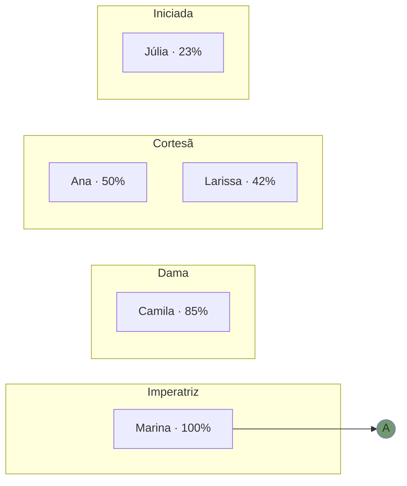

# Visão Tata — Layout do Dashboard Agregado da Corte

Dashboard que a Tata abre dia 1 de cada mês pra ver tudo em 60 segundos. Layout pensado pra leitura vertical em desktop + mobile-readable. Output HTML standalone (template em `TEMPLATE-HTML.md`).

---

## Princípios de design

1. **Cima → baixo = mais agregado → mais granular.** Header com KPI macro da Corte, depois matriz mentorada × porta, depois alertas individuais.
2. **Cor antes de número.** Tata bate o olho e em 3 segundos sabe se é dia bom ou dia de intervenção. Detalhe vem em hover/click.
3. **Tudo é filtrável.** Por nível hierárquico (Iniciada, Cortesã, Dama, Imperatriz), por porta, por cor.
4. **Decidir, não admirar.** Cada vermelho tem ação ao lado. Cada pronta-pra-Investidura tem botão "agendar cerimônia".
5. **Privacidade entre mentoradas.** A visão Tata é a única que cruza Corte. Nunca vai pra mentorada.

---

## Estrutura do dashboard (do topo pra baixo)

### 1. HEADER

Fixo no topo. Mostra:

- Eyebrow: "MÉTODO IMPERATRIZ · DASHBOARD CORTE · {{MES_ANO}}"
- H1: "Corte da *Imperatriz*" (Instrument Serif, dourado #D6A648 no itálico)
- Subtitle: 1 frase com agregado do mês (ex: "Receita agregada R$ 487k · 9 mentoradas · 67% verde geral")
- Meta-row com 6 cards macro:
  - **Mentoradas ativas** ({{N_ATIVAS}})
  - **Receita agregada** (R$ {{RECEITA}})
  - **Verde geral** ({{PCT_VERDE}}%)
  - **Vermelho geral** ({{PCT_VERMELHO}}%)
  - **Atenção urgente** ({{N_URGENTES}})
  - **Prontas Investidura** ({{N_PRONTAS}})

### 2. NAV TABS (sticky)

5 tabs:
1. **Visão geral** (default) — matriz + atenção
2. **Heatmap** — só a matriz expandida com Mermaid
3. **Investidura** — quem sobe, quem está perto, quem está longe
4. **Cases** — KPIs verdes consistentes 3+ meses
5. **Receita** — agregado financeiro

---

### 3. PANEL: VISÃO GERAL

#### 3.1 Matriz Mentorada × Porta (a peça central)

Tabela com:
- **Linhas:** mentoradas (ordenadas por nível hierárquico → Imperatriz → Dama → Cortesã → Iniciada)
- **Colunas:** 26 portas A-Z
- **Células:** quadrado colorido (verde/amarelo/vermelho/cinza-fora-do-escopo) com hover mostrando KPI + valor + benchmark
- **Última coluna:** "Score" (% verde da mentorada)
- **Última linha:** "Corte" (% verde por porta — qual é o gargalo da Corte?)

Pseudo-visual:

```
              A  B  C  D  E  F  G  H  I  J  K  L  M  N  O  P  Q  R  S  T  U  V  W  X  Y  Z  Score
Imperatriz:
  Marina      🟢 🟢 🟢 🟢 🟢 🟢 🟢 🟢 🟢 🟢 🟢 🟢 🟢 🟢 🟢 🟢 🟢 🟢 🟢 🟢 🟢 🟢 🟢 🟢 🟢 🟢   100%
Dama:
  Camila      🟢 🟢 🟢 🟢 🟢 🟢 🟢 🟢 🟢 🟢 🟢 🟡 🟢 🟢 🟢 🟢 🟢 🟢 🟢 🟢 🟢 🟢 ⬜ ⬜ 🟢 🟢   85%
Cortesã:
  Ana         🟢 🟢 🟢 🟢 🟢 🟢 🟢 🟡 🟢 🟢 🔴 🟡 ⬜ 🟡 🟢 ⬜ ⬜ ⬜ ⬜ ⬜ ⬜ ⬜ ⬜ ⬜ ⬜ ⬜    50%
  Larissa     🟢 🟢 🟢 🟢 🟢 🟡 🟢 🟢 🟡 🔴 🔴 ⬜ ⬜ 🟡 🟢 ⬜ ⬜ ⬜ ⬜ ⬜ ⬜ ⬜ ⬜ ⬜ ⬜ ⬜    42%
Iniciada:
  Júlia       🟢 🟢 🟢 🟡 🟢 🟡 ⬜ ⬜ ⬜ ⬜ ⬜ ⬜ ⬜ ⬜ ⬜ ⬜ ⬜ ⬜ ⬜ ⬜ ⬜ ⬜ ⬜ ⬜ ⬜ ⬜    23%
              ───────────────────────────────────────────────────────────────────────────
Corte:        100 100 100 80 100 60 80 70 60 50 30 60 50 70 100 50 50 50 50 50 50 50 50 50 50 50
```

(Legenda: 🟢 verde · 🟡 amarelo · 🔴 vermelho · ⬜ fora do escopo)

Filtros acima da tabela:
- Nível hierárquico (chips: Todas / Iniciada / Cortesã / Dama / Imperatriz)
- Cor (chips: Todas / Verde / Amarelo / Vermelho)
- Porta (dropdown A-Z)

#### 3.2 Atenção urgente (lista priorizada)

Cards ordenados pela regra de `ALERTAS-LOGICA.md`:

```
[🔴 CRÍTICO] Larissa — porta K (ROAS 1,8x meta 3x)
  ↳ Upstream contaminada: Causa (C) com mecanismo único sem proof stack
  → Ação: rollback pra C via /gates-imperatriz --rollback Larissa K

[🔴 ALTO] Ana — porta K (ROAS 1,9x)
  ↳ Vermelho na porta atual, sem upstream contaminada
  → Ação: /diagnostico-gargalo-funil Ana

[🟡 ATENÇÃO] Camila — ciclo L vencido há 23 dias
  → Ação: rodar teste A/B nessa semana

[🟡 ATENÇÃO] Júlia — porta D amarelo há 2 meses
  → Ação: revisar com /mecanismo-unico no próximo 1:1
```

#### 3.3 Receita agregada (mini-card)

```
RECEITA CORTE — MAIO/2026
─────────────────────────
Agregado:          R$ 487.300
Vs mês anterior:   +12,4%
Vs mesma compet. ano passado:  +47,2%

Top 3 contribuintes:
  Marina    R$ 142.000  (29%)
  Camila    R$ 98.500   (20%)
  Ana       R$ 67.800   (14%)
```

---

### 4. PANEL: HEATMAP

Versão Mermaid expandida da matriz. Para a Tata mostrar em call, exportar em PNG, mandar pra reunião com time.



(Renderização real será gerada dinamicamente. Ver template em `TEMPLATE-HTML.md`.)

---

### 5. PANEL: INVESTIDURA

Três grupos:

#### 5.1 Prontas agora

Cada uma com card:

```
[Foto] Marina Costa
       Sobe de Dama → Imperatriz
       ✓ Todas portas A-V verdes
       ✓ Ciclos W-Z em dia
       ✓ 3+ meses consistência
       
       [Agendar cerimônia] [Ver dossiê]
```

#### 5.2 Quase lá (1-2 portas)

```
Camila Ribeiro · Cortesã → Dama
  Falta: porta L (lift 11%, benchmark 15%)
  Estimativa: 1-2 meses
```

#### 5.3 Em construção

```
Ana Souza · Cortesã (estável) — 12/22 portas verdes pra subir
Larissa Lima · Cortesã → Dama — 13/22, foco K
Júlia Mendes · Iniciada → Cortesã — 4/12 verdes, foco D, F
```

---

### 6. PANEL: CASES

Lista de KPIs verdes consistentes 3+ meses prontos pra documentar:

```
Marina · Porta K · ROAS 4,8x consistente 6 meses
  → Material: campanha pra ICP "consultora 35-45a"
  → [Documentar caso] [Pedir depoimento]

Camila · Porta J · Conversão página fria 2,7% consistente 4 meses
  → Material: VSL com mecanismo "Método Olimpo"
  → [Documentar caso] [Pedir depoimento]

Ana · Porta N · 18 pubs/mês consistente 3 meses
  → Material: calendário com /calendario-imperatriz
  → [Documentar caso] [Pedir depoimento]
```

---

### 7. PANEL: RECEITA

Tabela mês a mês (últimos 12) por mentorada + total Corte. Permite ver tendência.

```
Mentorada      Jan   Fev   Mar   Abr   Mai   Total
─────────────────────────────────────────────────
Marina         98k   105k  118k  130k  142k   593k
Camila         62k   71k   78k   85k   98,5k  394,5k
Ana            45k   48k   52k   58k   67,8k  270,8k
Larissa        32k   28k   30k   35k   38k    163k
Júlia          12k   15k   18k   22k   25k    92k
─────────────────────────────────────────────────
TOTAL          249k  267k  296k  330k  371k   1.513k
```

---

### 8. FOOTER

- Data de geração
- Próximo update (dia 1 do próximo mês)
- Link pro JSON: `dashboard-tata.json`
- Link pra exportação CSV
- Crédito: "Travessia Imperatriz · Tata Gonçalves · Pilar 4 (Medição)"

---

## Comportamento interativo

### Cliques

- **Célula da matriz** → modal com detalhe do KPI (definição, valor, benchmark, histórico 6 meses, link pro arquivo no vault)
- **Nome da mentorada** → abre `dashboard-mentorada-[nome].html` em nova aba
- **Botão "Agendar cerimônia"** → copia comando `/calendario-imperatriz --evento investidura [nome]` pra clipboard
- **Botão "Documentar caso"** → copia comando `/anamnese-mentorada --case [nome] [porta]` pra clipboard

### Filtros

- Aplicam em tempo real, sem reload
- Estado persiste em localStorage (Tata fecha e abre sem perder filtro)

### Export

- Botão "Exportar PNG" → screenshot do panel ativo
- Botão "Exportar CSV" → tabela de KPIs (matriz crua)
- Botão "Exportar JSON" → JSON estruturado pra integrações

---

## Schema do JSON gerado (para integrações)

```json
{
  "geracao": {
    "skill": "dashboard-imperatriz",
    "modo": "tata",
    "mes_referencia": "2026-05",
    "timestamp": "2026-06-01T08:00:00-03:00"
  },
  "agregado_corte": {
    "mentoradas_ativas": 9,
    "receita_total_brl": 487300,
    "variacao_mes_anterior_pct": 12.4,
    "pct_verde_geral": 67,
    "pct_amarelo_geral": 18,
    "pct_vermelho_geral": 15,
    "n_urgentes": 4,
    "n_prontas_investidura": 1,
    "n_cases_prontos": 3
  },
  "mentoradas": [
    {
      "nome": "Marina Costa",
      "nivel": "Imperatriz",
      "score_pct": 100,
      "receita_mes_brl": 142000,
      "portas": {
        "A": { "cor": "verde", "kpi": "dossie_completo", "valor": 100, "benchmark": 100, "unidade": "pct" },
        "B": { "cor": "verde", "kpi": "icp_conv_vs_geral", "valor": 2.4, "benchmark": 2.0, "unidade": "x" },
        "...": "..."
      },
      "alertas": [],
      "pronta_investidura": false,
      "proximo_nivel": "—"
    }
  ],
  "alertas_priorizados": [
    {
      "prioridade": "critico",
      "mentorada": "Larissa Lima",
      "porta_atual": "K",
      "porta_fonte_contaminada": "C",
      "kpi": "roas",
      "valor": 1.8,
      "benchmark": 3.0,
      "acao_recomendada": "rollback C",
      "skill_recomendada": "/gates-imperatriz --rollback Larissa K"
    }
  ],
  "investidura": {
    "prontas": [{ "mentorada": "Marina Costa", "sobe_de": "Dama", "sobe_para": "Imperatriz" }],
    "quase_la": [...],
    "em_construcao": [...]
  },
  "cases": [
    {
      "mentorada": "Marina Costa",
      "porta": "K",
      "kpi": "roas",
      "consistencia_meses": 6,
      "documentado": false
    }
  ]
}
```

---

## Geração

A skill gera 2 arquivos por execução `--tata`:

1. `dashboard-tata.html` — standalone, abre em qualquer browser, funciona offline
2. `dashboard-tata.json` — estrutura acima

Salvos em:
```
~/Documents/Obsidian Vault/03 - Projetos/Dashboard-Corte/{{YYYY-MM}}/
```

Plus arquivos auxiliares:
- `alertas-criticos.md` — só lista priorizada (pra Tata copiar pro WhatsApp do time)
- `prontas-investidura.md` — só a lista de quem sobe (pra cerimônia trimestral)

---

**Visão Tata = único lugar onde a Corte aparece junta. A skill protege isso.**
