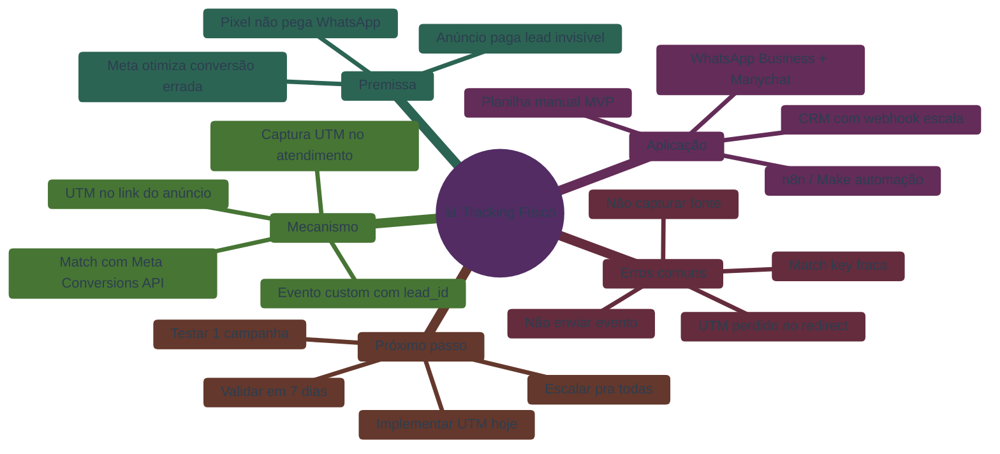

# 📊 Tracking Físico

> Mapa mental gerado pela skill `/mapa-mental-imperatriz` em modo `estudo`.
> Input: transcrição da aula 1 do Módulo Tracking Físico.

## 🧱 Premissa

- Pixel não pega WhatsApp
- Anúncio paga lead invisível
- Meta otimiza conversão errada

## ⚙️ Mecanismo

- UTM no link do anúncio
- Captura UTM no atendimento
- Match com Meta Conversions API
- Evento custom com lead_id

## 🛠️ Aplicação

- WhatsApp Business + Manychat
- Planilha manual (MVP)
- n8n / Make (automação)
- CRM com webhook (escala)

## ⚠️ Erros comuns

- Não capturar fonte do lead
- Não enviar evento de volta
- UTM perdido no redirect
- Match key fraca

## 🎯 Próximo passo

- Implementar UTM hoje
- Testar com 1 campanha
- Validar em 7 dias
- Escalar pra todas

---

## 🎨 Renderização Mermaid (pra Obsidian)

---

## 🔗 Conexões cruzadas identificadas

- `Premissa: Pixel não pega WhatsApp` ⇒ explica por que → `Mecanismo: UTM + API`
- `Mecanismo: Match com lead_id` ⊃ depende de → `Aplicação: CRM com webhook`
- `Erros: UTM perdido no redirect` ↔ contradiz → `Mecanismo: UTM no link`
- `Aplicação: Planilha manual` ⇒ evolui pra → `Aplicação: CRM com webhook`

## ✅ Validadores

- Buzan 7 princípios: ✓
- Balanceamento: ✓ (3-4 sub-ramos por ramo)
- Conexões cruzadas: ✓ (4 identificadas)

## 🎯 Próximos passos sugeridos

- `/skill-carrossel-instagram` — vira mapa em carrossel didático
- `/transcricao-mentoradas` — gerar materiais complementares completos
- `/voz-humana-br` — humanizar texto se virar post
