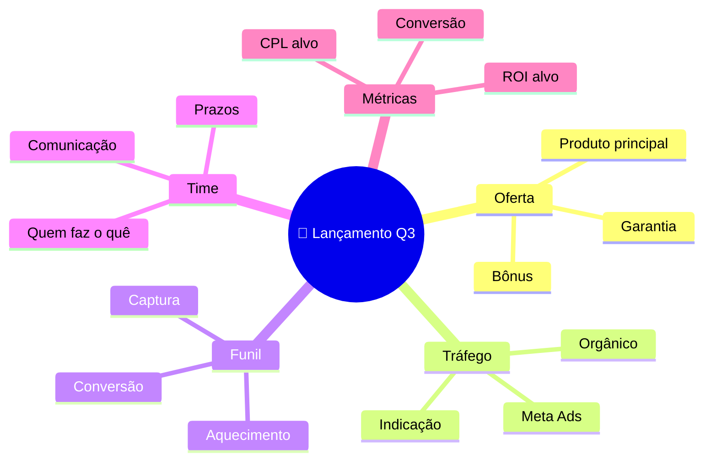

# Modo: BRAINSTORM

## Quando usar

- Input é texto solto ("ideias sobre X", "o que fazer pra Y")
- Lista de ideias bagunçada que precisa virar estrutura
- Tema novo onde ainda não tem estrutura mental

## Estratégia

Brainstorm bom não é "jogar tudo no papel". É **divergir, agrupar, hierarquizar**.

Você faz 3 movimentos:

1. **Divergência:** gera 15-30 ideias brutas (mentalmente, não mostra ainda)
2. **Agrupamento:** identifica 5-7 categorias que englobam essas ideias
3. **Hierarquização:** distribui as ideias dentro das categorias

## Hierarquia base

```
NÍVEL 0: Tema central (1-3 palavras)
NÍVEL 1: 5-7 categorias (substantivos abstratos)
NÍVEL 2: Ideias concretas (verbo no infinitivo OU substantivo específico)
NÍVEL 3: Detalhe/exemplo (opcional, só se agregar)
```

## Categorias-curinga (use como ponto de partida)

Quando não souber por onde começar, teste estas 7 lentes:

1. **Pessoas** — quem está envolvido?
2. **Tempo** — quando? em que ordem?
3. **Recursos** — o que precisa? (dinheiro, ferramentas, know-how)
4. **Riscos** — o que pode dar errado?
5. **Resultados** — o que muda quando funciona?
6. **Próximos passos** — ação imediata
7. **Conexões** — com o que isso se cruza?

Use 5-7 dessas, ou substitua por categorias específicas do tema.

## Como adaptar ao input

- Se o input já tem estrutura → usa estrutura existente como ramos
- Se é puramente solto → aplica as 7 lentes acima
- Se é muito grande → corta agressivamente, mantém só essencial

## Exemplo de output (Mermaid)

Tema: "Lançamento Q3 2026"



## Conexões cruzadas típicas

- Tráfego ↔ Funil (anúncio bate em página específica)
- Oferta ↔ Métricas (preço define CPL aceitável)
- Time ↔ Prazos (pessoa X bloqueia entrega Y)

## Erros a evitar

- Mais de 7 ramos principais (sinal de que não agrupou direito)
- Categorias vagas ("outros", "diversos")
- Ramos desbalanceados (1 com 12 itens, outro com 2)
- Frases inteiras nos nós (Buzan: palavra-chave única)
