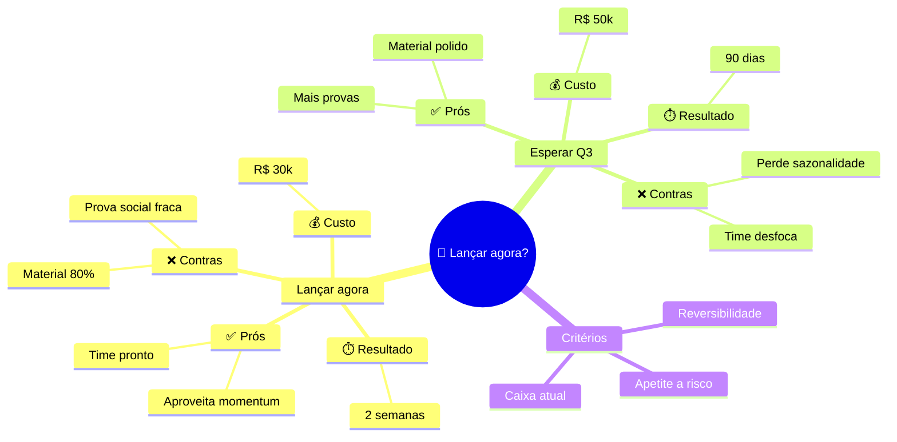

# Modo: DECISÃO

## Quando usar

- "Devo fazer X ou Y?"
- Comparar opções (ferramentas, ofertas, estratégias)
- Avaliar viabilidade ("vale a pena?")
- Escolha entre caminhos

## Estratégia

Mapa de decisão não recomenda — **clareia o trade-off**. Você organiza opções + critérios + consequências de modo que a pessoa enxergue.

3 movimentos:

1. **Definir critérios** (o que importa pra essa decisão?)
2. **Listar opções** (o que está em jogo?)
3. **Avaliar cada opção em cada critério**

## Hierarquia base

```
NÍVEL 0: A decisão (frase-pergunta curta)
NÍVEL 1: As opções (2-4)
NÍVEL 2: Avaliação (prós, contras, custo, prazo)
NÍVEL 3: Detalhes específicos
```

## Template universal

```
ROOT: <Decisão como pergunta>
├── Opção A
│   ├── ✅ Prós
│   ├── ❌ Contras
│   ├── 💰 Custo
│   └── ⏱️ Prazo
├── Opção B
│   ├── ✅ Prós
│   ├── ❌ Contras
│   ├── 💰 Custo
│   └── ⏱️ Prazo
└── Critérios de desempate
    ├── O que mais importa?
    └── Reversibilidade
```

## Critérios universais (use como ramos sob cada opção)

- **Custo** (R$, tempo, energia)
- **Risco** (o que pode dar errado)
- **Reversibilidade** (dá pra voltar atrás?)
- **Velocidade** (resultado em quanto tempo?)
- **Alinhamento** (combina com objetivo maior?)
- **Prova** (já funcionou pra alguém?)

Use 3-5, não todos.

## Adaptação ao input

- **Decisão binária (sim/não):** ramos viram "Se sim" e "Se não"
- **Múltiplas opções:** máximo 4. Acima disso, agrupa em "famílias" antes
- **Decisão técnica:** adiciona critério "Manutenção"
- **Decisão estratégica:** adiciona critério "Visão de longo prazo"

## Exemplo (Mermaid)

Decisão: "Lançar agora ou esperar Q3?"



## Conexões cruzadas típicas

- Custo de A ↔ Custo de B (comparação direta)
- Risco ↔ Reversibilidade (alto risco + irreversível = freio)
- Prós ↔ Contras da opção oposta (o que A tem, B não tem)

## Erros a evitar

- Recomendar uma opção (não é seu papel — você clareia)
- Comparar opções com critérios diferentes (precisa ser apples-to-apples)
- Listar 7+ opções (vira indecisão)
- Esquecer "não fazer nada" como opção legítima
