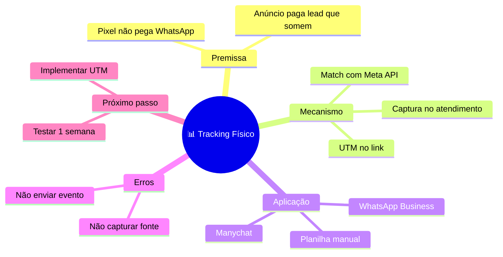

# Modo: ESTUDO

## Quando usar

- Input é transcrição de aula/mentoria
- Capítulo de livro, PDF de curso
- Vídeo do YouTube transcrito
- Artigo longo
- Material que precisa virar memória de longo prazo

## Estratégia

Mapa de estudo não é resumo. É **arquitetura de memorização**. Você cria âncoras visuais que o cérebro usa pra recuperar o conteúdo depois.

3 movimentos:

1. **Identificar a TESE central** (não o título — a ideia força)
2. **Extrair os pilares** (3-5 conceitos-mãe)
3. **Pendurar evidências** (exemplos, dados, citações como folhas)

## Hierarquia base

```
NÍVEL 0: Tese central (frase curta OU palavra-conceito)
NÍVEL 1: Pilares conceituais (3-5)
NÍVEL 2: Sub-conceitos (definições + relações)
NÍVEL 3: Exemplos / dados / citações (folhas de fixação)
```

## Templates por tipo de conteúdo

### Aula/mentoria

```
ROOT: <tema da aula>
├── Premissa (de onde parte)
├── Mecanismo (como funciona)
├── Aplicação (como usar)
├── Erros comuns
└── Próximo passo
```

### Livro

```
ROOT: <título do livro>
├── Tese central
├── Argumentos (3-5 maiores)
├── Evidências (cases, dados)
├── Frameworks ensinados
└── Aplicação prática
```

### Artigo/post

```
ROOT: <ideia central>
├── Problema apresentado
├── Tese do autor
├── Argumentos
├── Conclusão
└── O que faço com isso
```

## Adaptação ao input

- **Transcrição com timestamps:** mantém referências de tempo nos sub-ramos pra navegação
- **Conteúdo muito longo:** divide em "partes" no nível 1, depois desce
- **Múltiplos autores/fontes:** cria ramo "Vozes" agrupando perspectivas

## Exemplo (Mermaid) — aula sobre tracking



## Conexões cruzadas típicas

- Mecanismo ↔ Aplicação (passo técnico → ferramenta usada)
- Erros ↔ Próximo passo (cada erro vira ação)
- Premissa ↔ Aplicação (problema bate em ferramenta)

## Erros a evitar

- Resumir = copiar tudo. Mapa de estudo CORTA.
- Usar título da aula como root. Use a TESE.
- Misturar conceito com exemplo no mesmo nível.
- Esquecer "próximo passo" — todo estudo precisa de aplicação.
