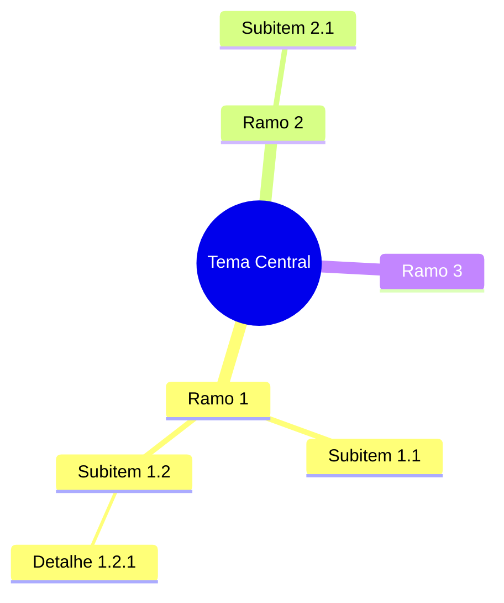
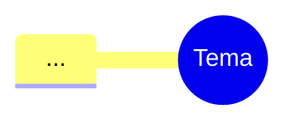
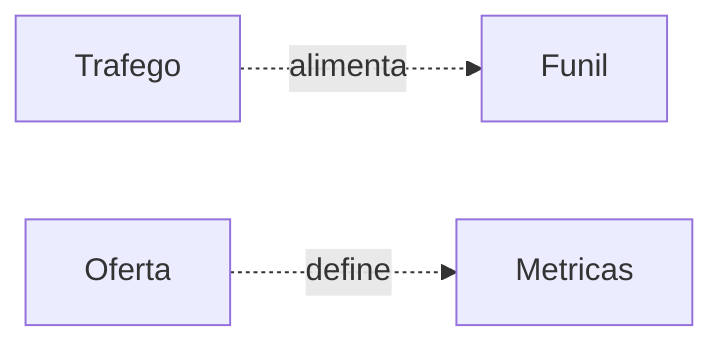
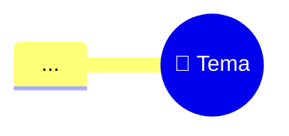

# Template Mermaid — base

## Sintaxe Mermaid mindmap



## Regras de formatação

### Root (centro)

Usar uma das formas:

- `((Texto))` — círculo (default — preferido)
- `[Texto]` — quadrado
- `(Texto)` — bordas arredondadas
- `{{Texto}}` — hexágono

**Recomendado:** `((🎯 Tema))` — círculo + emoji.

### Ramos

Indentação define hierarquia. Cada nível = 2 espaços a mais.

```
mindmap
  root((Tema))
    Ramo 1            ← 4 espaços
      Sub 1.1         ← 6 espaços
        Folha 1.1.1   ← 8 espaços
```

### Ícones (opcional)

```
mindmap
  root((Tema))
    Ramo
      ::icon(fa fa-rocket)
      Subitem
```

Disponíveis: Font Awesome 5 free.

## Cores e tema

Mermaid mindmap herda cor do tema. Pra controlar, usa `%%{init}%%`:



### Tema Imperatriz (padrão da Tata)

```
%%{init: {
  "theme": "base",
  "themeVariables": {
    "primaryColor": "#9b59b6",
    "primaryTextColor": "#2c3e50",
    "primaryBorderColor": "#8e44ad",
    "lineColor": "#7f8c8d",
    "background": "#fdfdfd",
    "fontFamily": "Inter, sans-serif"
  }
}}%%
```

Cores:
- Roxo profundo (Imperatriz): `#9b59b6`
- Esmeralda (acento): `#10b981`
- Dourado (destaque): `#f59e0b`
- Cinza grafite (neutro): `#374151`

## Conexões cruzadas

Mermaid mindmap **não suporta** conexões cruzadas nativamente. Pra esses casos:

**Opção 1:** comenta no markdown abaixo do mapa:

```markdown
## Conexões identificadas

- `Tráfego` ↔ `Funil` — anúncio bate em página específica
- `Oferta` ↔ `Métricas` — preço define CPL aceitável
```

**Opção 2:** usa diagrama `flowchart` separado pra conexões:



## Estrutura de arquivo final

```markdown
---
title: <Tema>
modo: <modo usado>
data: YYYY-MM-DD
ramos: <N>
---

# <Tema do mapa>



## Conexões identificadas

- ...

## Próximos passos

- ...
```

## Limitações conhecidas

- Máximo recomendado: ~50 nós (acima vira ilegível)
- Não suporta imagens nos nós (só ícones FA)
- Não suporta cores por nó individualmente (cor herda do nível)

Pra mapas com >50 nós ou que precisam de imagens/cores específicas, prefere **Markmap**.
