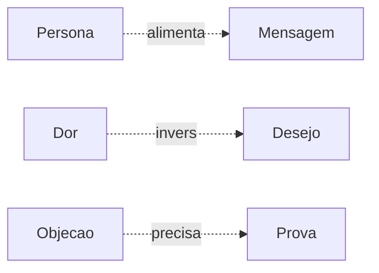

# Validador — Conexões Cruzadas

## Por que importa

Esta é a parte mais subestimada de mapa mental. Hierarquia mostra ESTRUTURA — conexões cruzadas mostram **insight**. É onde a mágica acontece: você vê que o ramo "Tráfego" e o ramo "Oferta" se afetam, e isso vira ideia.

## Como detectar conexões

Para cada par de ramos principais, pergunta:

1. **Causalidade:** A causa B?
2. **Dependência:** B precisa de A?
3. **Alimentação:** A produz algo que B consome?
4. **Tensão:** A e B competem (recursos, prioridade)?
5. **Reforço:** A torna B mais forte/fraco?
6. **Substituição:** A pode trocar B?

Se sim a qualquer uma, **conexão existe**.

## Tipos de conexão (e como nomear)

| Tipo | Símbolo | Label sugerido |
|------|---------|----------------|
| Causa | `→` | "causa", "leva a", "gera" |
| Dependência | `⊃` | "precisa de", "depende de" |
| Alimentação | `⇒` | "alimenta", "produz pra" |
| Tensão | `↔` | "compete com", "trade-off com" |
| Reforço | `+` | "reforça", "amplifica" |
| Substituição | `≡` | "alternativa a" |

## Mínimo: 2 conexões por mapa

Se mapa não tem nenhuma conexão cruzada, **provavelmente está errado**. Quase nenhum sistema real é puramente hierárquico.

## Exemplos por modo

### Modo COPY (comum)
```
Persona ⇒ alimenta vocabulário usado em → Mensagem
Dor ↔ inverso de → Desejo
Objeção ⊃ precisa de → Prova específica
Mecanismo ⇒ é razão de → Diferencial
```

### Modo LANÇAMENTO
```
Pré-lançamento ⇒ alimenta material de → Aquecimento
Aquecimento ⇒ aquece pra → Carrinho aberto
Carrinho aberto ⊃ depende de → Oferta finalizada
Métricas ↔ avalia → todas as fases
```

### Modo DIAGNÓSTICO
```
Oferta ↔ Mensagem (oferta forte com copy fraca = mesma raiz)
Tráfego → Conversão (mais tráfego em página quebrada não resolve)
Sistema → afeta tudo (ferramentas afetam todos os pilares)
```

### Modo ECOSSISTEMA (CRÍTICO)
```
briefing-copy-360 ⇒ alimenta → headline-imperatriz
headline-imperatriz ⇒ alimenta → skill-pagina-vendas
mecanismo-unico ⇒ compõe → skill-historia-metodo
voz-humana-br ↔ valida saída de → todas as skills de copy
```

## Como representar visualmente

### Em Mermaid mindmap

Mermaid mindmap **não suporta** conexões cruzadas. Workaround:

**Opção 1:** seção markdown abaixo do mapa:

```markdown
## 🔗 Conexões cruzadas

- `Persona` ⇒ alimenta → `Mensagem`
- `Dor` ↔ inverso de → `Desejo`
- `Objeção` ⊃ precisa de → `Prova`
```

**Opção 2:** flowchart separado:



### Em Markmap

Markmap aceita links HTML. Conexão vira:

```markdown
- Persona [→ alimenta Mensagem](#mensagem)
```

### Em Obsidian Canvas

Suporte nativo. Cria edge entre nós:

```json
{
  "edges": [
    {
      "id": "cross-1",
      "fromNode": "persona",
      "toNode": "mensagem",
      "label": "alimenta",
      "color": "5"
    }
  ]
}
```

## Algoritmo de detecção (mental)

Para cada ramo principal R1:
  Para cada outro ramo R2:
    1. Os termos das folhas de R1 aparecem nas folhas de R2?
    2. Faz sentido R1 → R2 em causa/dependência/alimentação?
    3. Há tensão lógica entre R1 e R2?
    4. Se SIM a qualquer pergunta: conexão existe
    5. Identifica TIPO e adiciona

Limita a **5 conexões** no total — mais que isso vira spaghetti visual.

## Output do validador

```
Conexões cruzadas:
  Identificadas: 4
    1. Persona ⇒ alimenta → Mensagem [tipo: alimentação]
    2. Dor ↔ inverso → Desejo [tipo: tensão]
    3. Objeção ⊃ precisa → Prova [tipo: dependência]
    4. Mecanismo ⇒ é razão → Diferencial [tipo: alimentação]

Status: ✓ APROVADO (mínimo 2)
```

Se = 0 ou 1, força revisão e adiciona pelo menos 2.
